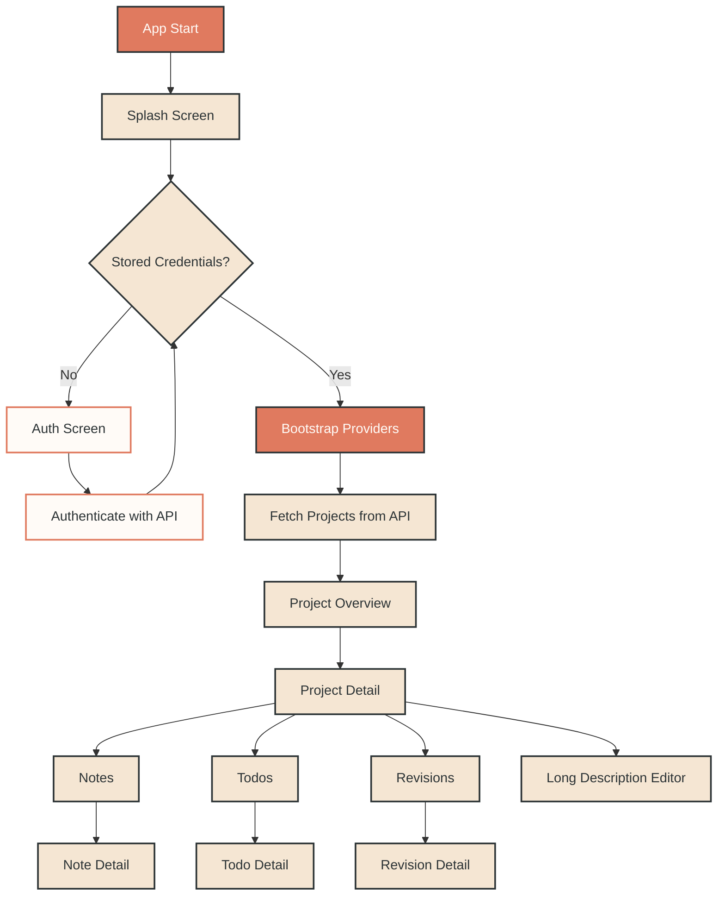
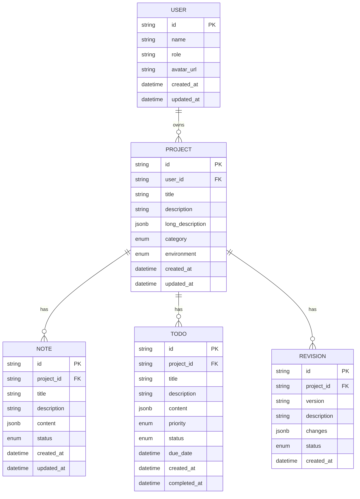

# Catatan Kaki

Catatan Kaki is a Flutter application for coordinating projects, notes, revisions, and todos through a streamlined interface connected to a remote API.

## Key Features

### Project Workspace
- Project categories: Web, Mobile, Desktop, API, Other
- Environment tags: Development, Staging, Production
- Long-form documentation captured through the Quill-powered editor
- Automatic created/updated timestamps synced from the API

### Note System
- Rich text editing powered by Flutter Quill
- Status workflow across Draft, Active, and Archived notes
- Responsive grid/list layouts with quick detail, edit, and delete actions
- Notes stay linked to their project and refresh via the detail provider

### Revision Tracking
- Versioned change logs with detailed descriptions
- Status workflow: Pending, Approved, Rejected
- Chronological history of all revisions within a project
- Inline status chips highlight review state at a glance

### Todo Management
- Priority levels: Low, Medium, High, Urgent
- Status workflow: Pending, In Progress, Completed, Cancelled
- Due date tracking with overdue highlighting and detailed descriptions
- Optional rich text content for implementation notes

### User Experience
- Email/password authentication with combined sign-in and sign-up screen
- Session bootstrap on launch via cached token and profile lookup
- Dashboard metrics summarising projects, notes, revisions, and todos
- Adaptive Material 3 interface tuned for desktop, tablet, and mobile

## Application Flow

The application now synchronises with the backend API for authentication and data. The high-level flow is illustrated below.



## Architecture Overview

- State management with Provider for scalable composition
- Repository layer abstracts API access
- Service layer encapsulates authentication and business rules
- Shared `ApiClient` injects the base URL defined in environment configuration

## Environment Configuration

The application expects a `.env` file at the project root. Use `.env.example` as a template.

```
BASE_URL=https://api.com
```

`BASE_URL` must point to the backend API the app should consume. The production `.env` is ignored by Git to keep credentials out of source control.

After editing `.env`, run `flutter pub get` so the Flutter tool picks up asset changes.

## Design System

- Primary colour: `#E07A5F`
- Secondary colour: `#F5E6D3`
- Background colour: `#FFFBF7`
- Text colour: `#2D3436`
- Material 3 components, responsive layouts, and keyboard accessibility

## Database Schema



## Linux Build Guide

### Prerequisites

Ensure Flutter is installed with Linux desktop support enabled.

```
flutter doctor
flutter config --enable-linux-desktop
```

Install the required build dependencies on Ubuntu/Debian.

```
sudo apt update
sudo apt install build-essential clang cmake ninja-build pkg-config libgtk-3-dev liblzma-dev
```

### Standard Release Build

Generate a release bundle without packaging:

```
flutter build linux --release
```

### Create a Debian Package

Use the helper script to build the Flutter bundle and package it as `.deb`:

```
./tool/package_linux.sh
```

The script outputs `catatan-kaki_<version>_amd64.deb` in `dist/linux/`, matching the `version` field in `pubspec.yaml`.

### Install the Package

Install on the target system with `dpkg`.

```
sudo dpkg -i dist/linux/catatan-kaki_<version>_amd64.deb
```

Re-run the packaging script to rebuild; previous artefacts are overwritten automatically.
