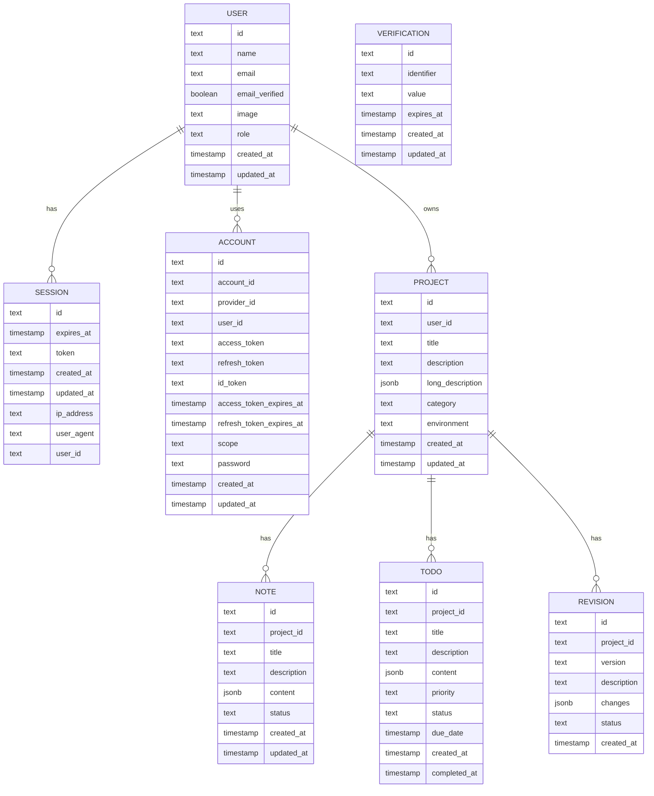
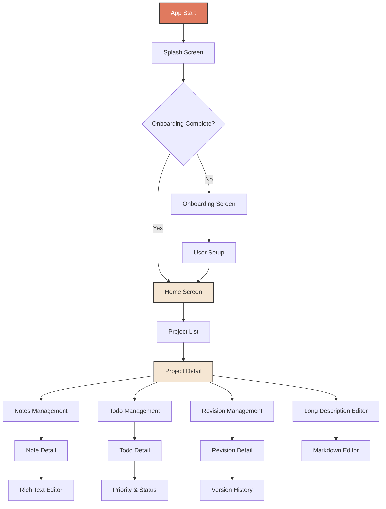

# Project Manager API

> API backend untuk aplikasi Project Manager menggunakan Next.js Route Handlers dengan Better Auth, Drizzle ORM, dan Neon PostgreSQL.

## 📘 Overview

- CRUD lengkap untuk projects, notes, todos, dan revisions yang selalu scoped ke user yang sedang login.
- Authentication email/password via Better Auth dengan session token yang dapat dipakai sebagai `Authorization: Bearer` di setiap request API.
- Pagination, pencarian, dan filter enum tersedia di semua endpoint koleksi; respons sudah mengembalikan metadata pagination.
- Struktur respons dan validasi ditulis ulang dengan helper `withErrorHandling`, sehingga error selalu dikembalikan dalam format konsisten.
- Koleksi Postman `Project Manager API.postman_collection.json` berisi request siap pakai beserta script otomatis untuk menyimpan token.

## 🛠️ Tech Stack

- **Framework**: Next.js 15 (Route Handlers)
- **Authentication**: Better Auth (email & password)
- **Database**: Neon PostgreSQL
- **ORM**: Drizzle ORM
- **Package Manager**: pnpm
- **TypeScript**: Full type safety
- **Validation**: Zod (melalui helper Better Auth & custom schema)

## 🔐 Authentication

| Method | Path | Deskripsi |
| --- | --- | --- |
| `POST` | `/api/auth/sign-up/email` | Registrasi user baru dengan email & password. |
| `POST` | `/api/auth/sign-in/email` | Login dan mendapatkan session token. |
| `GET` | `/api/auth/get-session` | Mengecek session aktif. |
| `POST` | `/api/auth/sign-out` | Logout serta mencabut session-token aktif. |

**Body Sign Up** (Sign In cukup `email` + `password`):

```json
{
  "email": "test@example.com",
  "password": "TestPassword123!",
  "name": "Test User"
}
```

Setiap request terautentikasi perlu menyertakan header `Authorization: Bearer <session_token>` (lihat script pada koleksi Postman) atau cookie session yang dipasang oleh Better Auth.

Respons sukses dari Better Auth memuat `user`, `session`, dan `token` sehingga token dapat disimpan untuk request selanjutnya.

## 📦 Response Format

- **Sukses (koleksi)**: semua endpoint daftar mengembalikan objek dengan `data` (array) dan `meta` (pagination).
- **Sukses (detail/mutasi)**: endpoint detail mengembalikan objek tunggal; endpoint DELETE mengembalikan `{ "id": "..." }` dari record yang dihapus.
- **Error**: seluruh error terbungkus oleh `ApiError` dan selalu mengembalikan bentuk berikut:

  ```json
  {
    "error": "Validation error",
    "details": {
      "field": ["Pesan error"]
    }
  }
  ```

  HTTP status akan menyesuaikan: `401` untuk unauthorized, `404` untuk data yang tidak ditemukan, `422` untuk validation error, `500` jika gagal internal.

## 🔁 Pagination & Filtering

Parameter query standar:

- `page` (default `1`) dan `pageSize` (default `10`, maksimum `50`).
- `search` mendukung pencarian `title` untuk projects/notes/todos dan `version` pada revisions.
- Filter enum mengikuti daftar nilai di bagian [Enumerations](#-enumerations).
- Tambahan khusus todos: `priority`, `status`, `dueBefore`, `dueAfter` (ISO date string).

Nilai balikan `meta` berisi `page`, `pageSize`, `total`, dan `hasNextPage`.

## 📚 Resources

### Projects

| Method | Path | Deskripsi |
| --- | --- | --- |
| `GET` | `/api/projects` | Daftar project milik user aktif dengan pagination & filter. |
| `POST` | `/api/projects` | Membuat project baru. |
| `GET` | `/api/projects/:id` | Detail project + statistik terkait (notes/todos/revisions). |
| `PATCH` | `/api/projects/:id` | Update sebagian field project. |
| `DELETE` | `/api/projects/:id` | Menghapus project beserta relasi turunannya. |

**List Projects – 200**

Request dapat menyertakan `search`, `category`, atau `environment`.

```json
{
  "data": [
    {
      "id": "proj_123",
      "userId": "user_123",
      "title": "Website Redesign",
      "description": "Short blurb",
      "longDescription": { "content": [] },
      "category": "web",
      "environment": "development",
      "createdAt": "2024-03-01T12:00:00.000Z",
      "updatedAt": "2024-03-02T07:10:00.000Z"
    }
  ],
  "meta": {
    "page": 1,
    "pageSize": 10,
    "total": 1,
    "hasNextPage": false
  }
}
```

**Create Project – Body**

```json
{
  "title": "New Project",
  "description": "Optional short description",
  "longDescription": { "content": [] },
  "category": "web",
  "environment": "development"
}
```

Respons `201` mengembalikan record project lengkap dengan `id`, `userId`, `createdAt`, dan `updatedAt`.

**Get Project by Id – 200**

```json
{
  "data": {
    "id": "proj_123",
    "userId": "user_123",
    "title": "Website Redesign",
    "description": "Short blurb",
    "longDescription": { "content": [] },
    "category": "web",
    "environment": "staging",
    "createdAt": "2024-03-01T12:00:00.000Z",
    "updatedAt": "2024-03-02T07:10:00.000Z"
  },
  "stats": {
    "notes": 3,
    "todos": 5,
    "revisions": 2,
    "completedTodos": 1
  }
}
```

**PATCH** menerima kombinasi dari `title`, `description`, `longDescription`, `category`, dan `environment`. Semua field opsional namun minimal satu field harus ada.

**DELETE** mengembalikan `{ "id": "proj_123" }` bila sukses.


### Statistics

| Method | Path | Deskripsi |
| --- | --- | --- |
| `GET` | `/api/statistics` | Statistik global untuk user aktif (jumlah project, note, todo, revision). |

**Get Global Statistics – 200**

```json
{
  "projectsCount": 5,
  "noteCount": 12,
  "todoCount": 28,
  "revisionsCount": 7
}
```

### Notes

| Method | Path | Deskripsi |
| --- | --- | --- |
| `GET` | `/api/projects/:id/notes` | Daftar notes milik project. Mendukung `status` & `search`. |
| `POST` | `/api/projects/:id/notes` | Membuat note baru untuk project tersebut. |
| `GET` | `/api/projects/:id/notes/:noteId` | Detail note. |
| `PATCH` | `/api/projects/:id/notes/:noteId` | Update sebagian field note. |
| `DELETE` | `/api/projects/:id/notes/:noteId` | Menghapus note. |

**Create Note – Body**

```json
{
  "title": "Kick-off Meeting",
  "description": "Ringkasan pertemuan awal",
  "content": { "blocks": [] },
  "status": "active"
}
```

**List Notes – 200**

```json
{
  "data": [
    {
      "id": "note_123",
      "projectId": "proj_123",
      "title": "Kick-off Meeting",
      "description": "Ringkasan pertemuan awal",
      "content": { "blocks": [] },
      "status": "active",
      "createdAt": "2024-03-02T03:00:00.000Z",
      "updatedAt": "2024-03-02T04:15:00.000Z"
    }
  ],
  "meta": {
    "page": 1,
    "pageSize": 10,
    "total": 1,
    "hasNextPage": false
  }
}
```

**PATCH** mendukung `title`, `description`, `content`, dan `status` (minimal satu field). `DELETE` mengembalikan `{ "id": "note_123" }` jika berhasil.

### Todos

| Method | Path | Deskripsi |
| --- | --- | --- |
| `GET` | `/api/projects/:id/todos` | Daftar todos. Filter: `status`, `priority`, `search`, `dueBefore`, `dueAfter`. |
| `POST` | `/api/projects/:id/todos` | Membuat todo baru. |
| `GET` | `/api/projects/:id/todos/:todoId` | Detail todo. |
| `PATCH` | `/api/projects/:id/todos/:todoId` | Update sebagian field todo. |
| `DELETE` | `/api/projects/:id/todos/:todoId` | Menghapus todo. |

**Create Todo – Body**

```json
{
  "title": "Setup CI",
  "description": "Konfigurasi pipeline lint & test",
  "content": { "checklist": [] },
  "priority": "high",
  "status": "pending",
  "dueDate": "2024-03-10T00:00:00.000Z"
}
```

**List Todos – 200**

```json
{
  "data": [
    {
      "id": "todo_123",
      "projectId": "proj_123",
      "title": "Setup CI",
      "description": "Konfigurasi pipeline lint & test",
      "content": { "checklist": [] },
      "priority": "high",
      "status": "pending",
      "dueDate": "2024-03-10T00:00:00.000Z",
      "createdAt": "2024-03-02T05:00:00.000Z",
      "completedAt": null
    }
  ],
  "meta": {
    "page": 1,
    "pageSize": 10,
    "total": 1,
    "hasNextPage": false
  }
}
```

**PATCH** menerima `title`, `description`, `content`, `priority`, `status`, `dueDate`, dan `completedAt`. Jika `status` diubah menjadi `completed` dan `completedAt` tidak dikirim, sistem otomatis men-stamp `completedAt` dengan waktu sekarang.

### Revisions

| Method | Path | Deskripsi |
| --- | --- | --- |
| `GET` | `/api/projects/:id/revisions` | Daftar revisions dengan filter `status` & `search` (versi). |
| `POST` | `/api/projects/:id/revisions` | Membuat revision baru. |
| `GET` | `/api/projects/:id/revisions/:revisionId` | Detail revision. |
| `PATCH` | `/api/projects/:id/revisions/:revisionId` | Update revision. |
| `DELETE` | `/api/projects/:id/revisions/:revisionId` | Menghapus revision. |

**Create Revision – Body**

```json
{
  "version": "1.0.1",
  "description": "Minor bugfix release",
  "changes": ["Fix login throttle"],
  "status": "pending"
}
```

**List Revisions – 200**

```json
{
  "data": [
    {
      "id": "rev_123",
      "projectId": "proj_123",
      "version": "1.0.1",
      "description": "Minor bugfix release",
      "changes": ["Fix login throttle"],
      "status": "approved",
      "createdAt": "2024-03-02T06:00:00.000Z"
    }
  ],
  "meta": {
    "page": 1,
    "pageSize": 10,
    "total": 1,
    "hasNextPage": false
  }
}
```

`PATCH` mendukung `version`, `description`, `changes`, dan `status`. `DELETE` mengembalikan `{ "id": "rev_123" }` jika sukses.

## 🧾 Enumerations

| Nama | Nilai |
| --- | --- |
| `category` | `web`, `mobile`, `desktop`, `api`, `other` |
| `environment` | `development`, `staging`, `production` |
| `note_status` | `draft`, `active`, `archived` |
| `priority` | `low`, `medium`, `high`, `urgent` |
| `todo_status` | `pending`, `in_progress`, `completed`, `cancelled` |
| `revision_status` | `pending`, `approved`, `rejected` |

## 🗄️ Database Schema


## 📊 Flow Aplikasi


